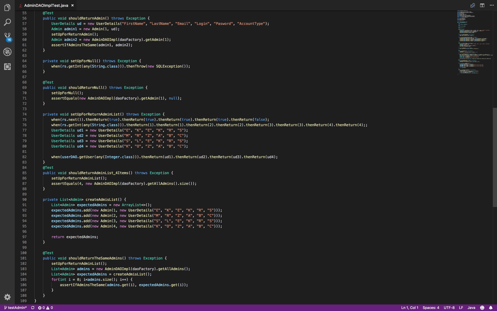
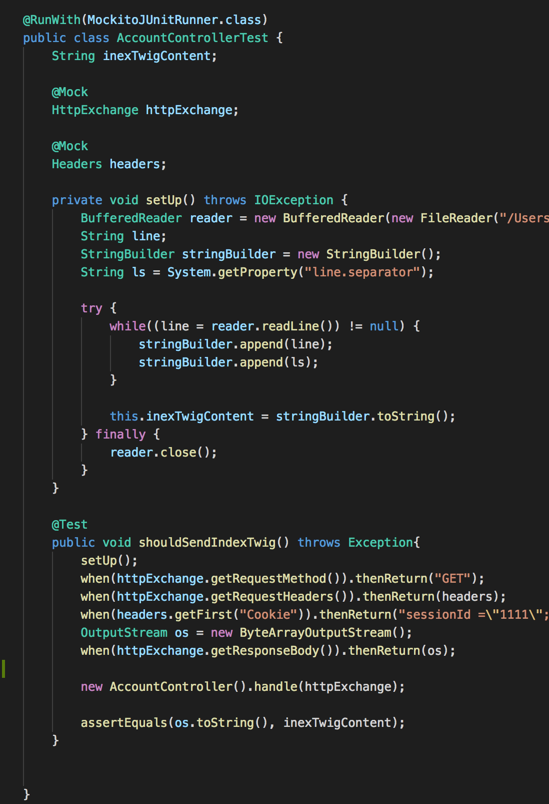

# QuestStore Tests
The purpose of this week was to write tests for other team project - QuestStore

# Quest Store
The Queststore is the platform where you can use your well earned coins to buy certain events. The store items do not have any material value they represent activities or events that enhance the [Codecool](https://codecool.com/) experience. The store offers two type of items basic and extra (magic). Basic items are meant for individual buyers while extra items are designed to be purchased by a group of students. Assortment and prices can be change at the beginning of week, depending on demand and supply.

